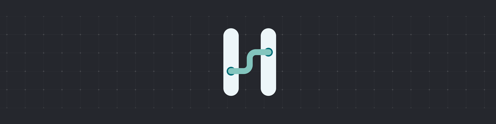

# Hengo Visual Script

> [!WARNING]
> 🚧 Hengo is still under development! Expect bugs and incomplete features as we continue to improve it.

**Hengo** is a node-based visual scripting tool for the Godot editor. You build game logic on a graph
of connected nodes, functions, variables, signals, states and actions, instead of writing GDScript by
hand.

Hengo has no runtime interpreter: it **compiles your graph into real GDScript**, so the output is
plain, readable code that runs with zero overhead.

## Philosophy

- **The graph is the source, GDScript is the build.** Everything you draw compiles to a normal `.gd`
  file you attach to a node like any other script.
- **Zero overhead, zero lock-in.** The generated script keeps running even if the plugin is removed,
  and anything GDScript can do, Hengo can do.
- **State machines first.** A script is a finite state machine with `enter` / `update` / `physics` /
  `exit` phases and a visual State Viewer.
- **Actions instead of boilerplate.** Playmaker-style steps dropped on a state cover the common
  logic. Each action is a small GDScript file, so your project can add its own.
- **See it running.** A live debugger highlights the active state and the executing flow while the
  game plays.

## Requirements

- **Godot 4.7** (Forward+ or Compatibility). Hengo uses 4.7-era APIs, older versions will not run it.
- No runtime dependencies: Hengo only touches the editor and generates plain GDScript.

## Installation

1. Download from the [**Releases page**](https://github.com/Henrique-Henrique/Hengo/releases).
2. Extract it at the root of your Godot project, the addon lands in `res://addons/hengo/`.
3. Open **Project → Project Settings → Plugins** and enable **Hengo**.

Cloning this repository works too: copy its `addons/hengo/` folder into your project's
`res://addons/` directory. The releases are the tested snapshots, `main` is the development branch.

A **Hengo** tab appears in the editor's **bottom panel**. Click it to open the tool. To move it, use
the gear in the top bar and change **Dock Location**.

## Your first script

1. On the **Dashboard**, click **New Collection** and name it.
2. Create a script: give it a name, pick the class it **extends** (e.g. `Node2D`), then
   **Create & Open**.
3. In the **Props** tab, add a variable and a **New State** (call it `Main`). Right-click the state
   row and mark it as the **start state**: every machine needs exactly one.
4. On the state card, click **Add Action**, search for **Print Value**, drop it on the **enter**
   phase and set its value.
5. Press **Compile All** in the top bar. The **Code Preview** tab shows the generated GDScript.
6. Attach `res://hengo/scripts/<name>.gd` to a node of the matching type and run the scene.

> [!IMPORTANT]
> There is no Ctrl+S and no autosave. **Your graph is saved as part of Compile**, so compile often.

## Where your files live

Hengo stores everything under `res://hengo/`:

- `res://hengo/collections/`, the editable graph data (the **source**), hidden from the Godot
  importer by a `.gdignore`.
- `res://hengo/scripts/`, the generated GDScript (the **build**) you attach to nodes.

Both are project files, so they commit to Git like any other Godot resource.

## Links

- **Website**: [hengoscript.com](https://hengoscript.com)
- **Documentation**: [hengoscript.com/docs](https://hengoscript.com/docs/)
- **Actions reference**: [hengoscript.com/docs/actions](https://hengoscript.com/docs/actions/)
- **Custom actions**: [writing your own](https://hengoscript.com/docs/extending/custom-actions/)
- **Discord**: [join the server](https://discord.gg/KapbHgb5FM)

Questions and bug reports are welcome on Discord or in the issue tracker.

## License

MIT. See [LICENSE](LICENSE).
