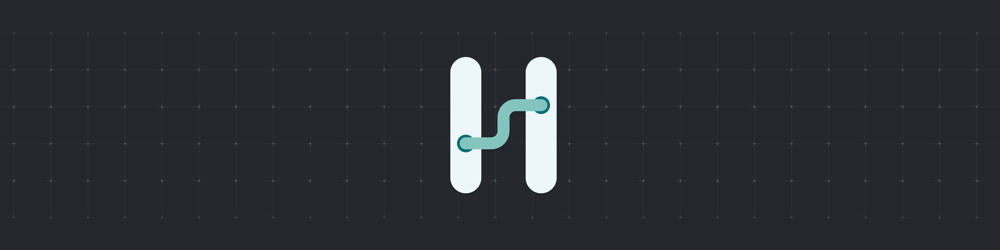

# Hengo Visual Script

> [!WARNING]
> 🚧 (**Dev1**) Hengo is still under development! Expect bugs and incomplete features as we continue to improve it.

## Overview

**[Hengo](https://hengoscript.com)** is a **Godot Visual Script** designed to simplify and enhance your workflow. It allows you to create logic visually while compiling directly into GDScript for seamless integration with Godot Engine.

  
_Hengo Demo_

---

## Key Features

##### 📋 **Finite State Machines (FSM)**

- Organize and control logic flows with FSMs.

##### 🛠️ **Flow Debugger**

- Visualize your logic flow in real-time.

##### 🧾 **Code Preview**

- See the GDScript code that will be generated from your visual flow.

##### 🔄 **Safe Changes**

- Hengo ensures that all dynamic instances stay updated whenever values are modified.

---

## Installation

Follow these steps to install **Hengo**:

1. **Download the ZIP file** from the repository (Hengo is still under development!).
2. **Extract the `addons` folder** from the ZIP file.
3. **Move the `addons` folder** to your Godot project folder.
4. Open Godot and go to: **Project > Project Settings**
5. Click on the **Plugins** tab.
6. Find **Hengo** in the list and tick the **Enabled** checkbox.

## Documentation

For now, I'm creating the documentation on Discord.  
Join my [Discord](https://discord.gg/KapbHgb5FM) for more information, to help me out, or just to chat!
